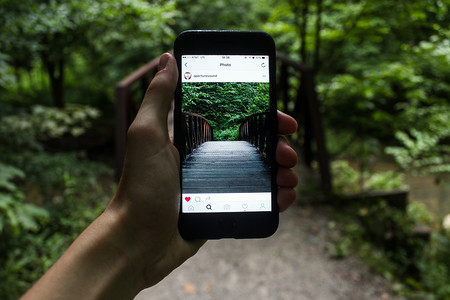
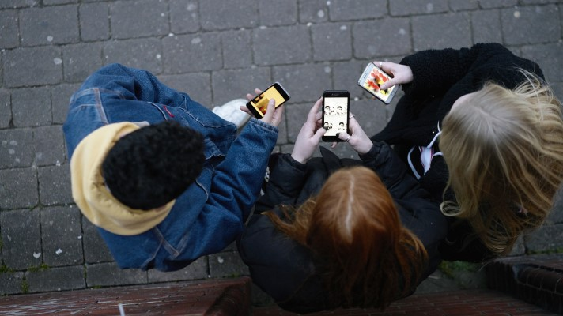
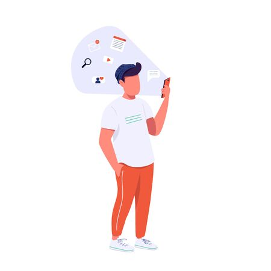
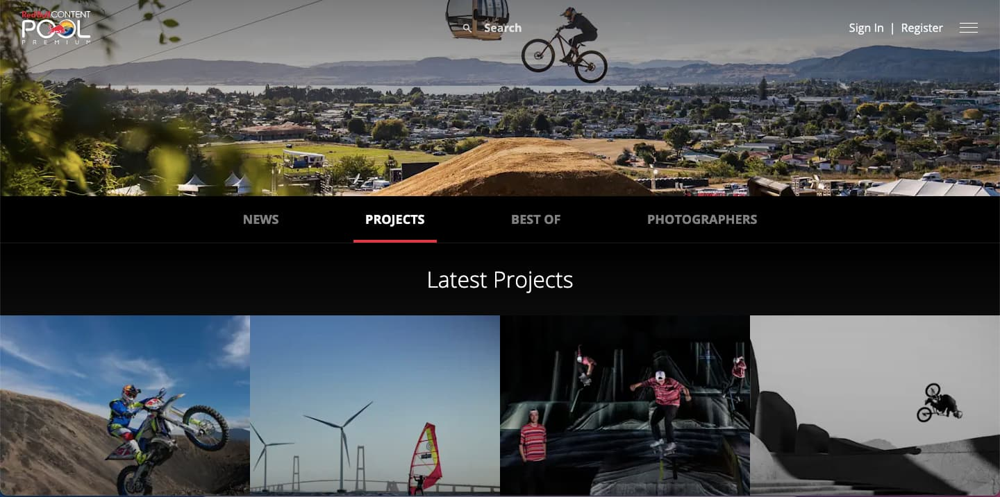
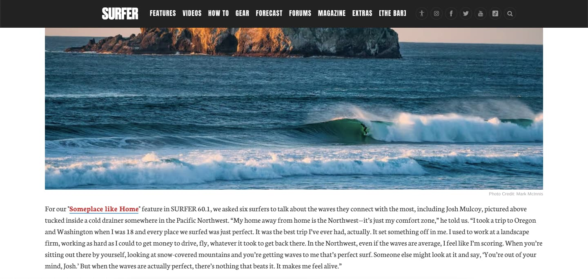
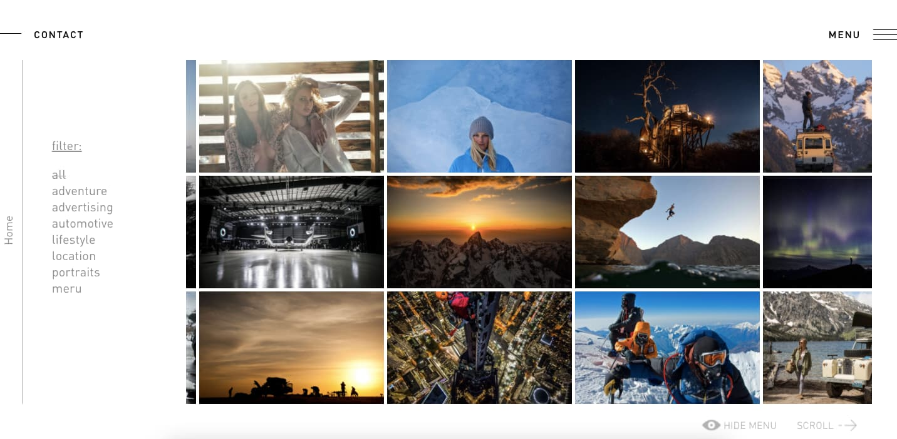
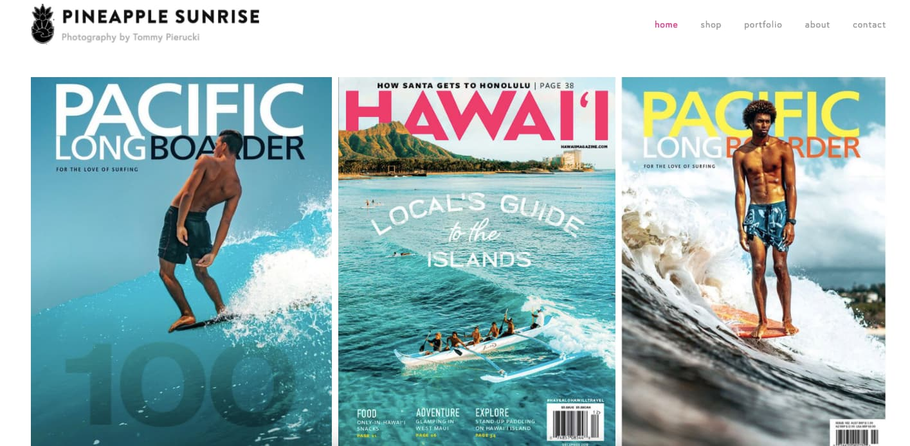
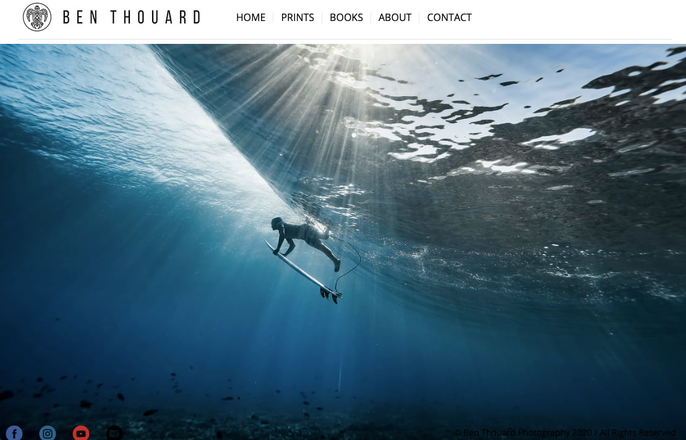

# ProyectoFinal

## **1. ¿Para qué?**

Alcanzar a un publico mas amplio con mis tomas fotograficas.

## **2. ¿Para quiénes?**

Actualmente utilizo las redes sociales para compartir mi trabajo. Por lo tanto, el publico puede ir desde un usuario promedio de instagram, a fotografos o compañias mas profesionales respecto al tema. El usuario medio vendria siendo alguien con interes en el rubro, pero sin tener el tamaño o la importancia de un profesional. A este usuario medio lo describire como un freelancer.

* **Usuario Medio**

Como el usuario medio nos encontramos con aficionados a la fotografia con presencia en redes sociales. Suelen estar en una etapa de encontrar su "camino", generalmente con 4to medio ya hecho. El rango etario puede ir desde los 18 años a los 30 en adelante.

Les **gusta** estar informado sobre temas relacionados a la fotografia. Tambien les agrada subir su contenido y mostrarse al mundo como fotografos. 

**Sienten** pasion, o al menos gusto, por capturar momentos y luego compartirlos.

**Hacen** publicaciones relacionadas al area de la fotografia. A veces realizan tutoriales para hacer mas engagement, y tambien suelen comentar y apoyar a otros fotografos buscando que hagan lo mismo por ellos.

* **Extremo inferior**

Como usuario del extremo inferior nos encontramos a la tipica persona que usa redes sociales a diario. Por lo general son estudiantes desde los 13 años hasta los 26 aproximadamente (cada día el intervalo es mas grande).

A estas personas les **gusta** ver lo que esta pasando en su entorno. Se preocupan de lo que es tendencia y les agrada estar "al día" con los acontecimientos mas actuales.

**Sienten** la necesidad de estar utilizando sus celulares gran parte del día. Se enfrentan a una enormidad de contenido casi siempre, y principalmente sienten mas satisfaccion viendo contenido "entretenido".

Pueden **hacer** de todo, como hacer nada. Las redes sociales pueden ser un break de la rutina, como una adiccion que quita mucho tiempo. Lo que tienen en comun todas estas personas es que miran mucho contenido de muchas personas todo el tiempo.

* **Extremo Superior**

Como extremo superior ya nos encontramos con gente profesional de la industria.

Les **gusta** encontrar nuevos talentos o aportes para su trabajo. Les gusta el reconocimieto y estar posicionados como fotografos de alta gama. Tambien les gusta compartir sus conocimientos en ciertas ocaciones.

**Sienten** realizacion por donde estan y lo que han logrado. Todo fotografo profesional es fruto de mucho esfuerzo. 

**Hacen** todo tipo de fotografias. En algunos casos crean estudios profesionales, invierten en excelente equipo, buena iluminacion, los mejores programas. Hacen cursos para tener mas fuentes de ingreso.

## **3. Antecedentes. Lo que ya existe parecido.**

* [Red Bull Content Pool](https://www.redbullcontentpool.com/premium/photography/best-of)

Me encanta todo el proyecto que tiene Red Bull con la media y la plataforma para compartir contenido de deportes extremos. Siento que lo hace como ningun otro, y eso se ve representado en la calidad de pagina que tiene, atletas y fotografos. 

Su pagina me gusta por como presenta la diversidad de proyectos que tiene, y por las descripciones que tienen estos. Comparten el proceso y la imagenn, no solo el resultado. 

* [SURFER](https://www.surfer.com/features/the-20-best-surf-photos-from-2019/)

Surfer es un clasico para cualquier persona que sienta interes en el surf. Llevan años en la industria y siempre estan atentos con las ultimas marejadas. Esta pagina destaca por tener las mejores olas de todo el mundo.

Al ser una revista, la pagina cuenta con muchisimas historias. Me gusta el detras de escenas que tienen las fotografias que publican. 

* [Jimmy Chin](https://jimmychin.com/)

Jimmy Chin fue uno de los protagonistas en el documental *"FreeSolo"*, donde un escalador llego a la cima de "El Cap" sin cuerdas. Tiene un peso grande en la industria y su pagina demuestra la calidad de creador que es. Practica varios deportes y tiene mucho conocimiento de como lograr buenas tomas entodos estos. 

Su pagina tiene una portada increible. La divide en tres y tiene mucho movimiento. Es moderna y se ve profesional.

* [Tommy Pierucki](https://www.pineapplesunrise.com/)

A este fotografo lo encontre hace poco en Instagram, y tiene un estilo suave con colores agradables que no habia visto. Me encanta la armonia y la simpleza de su trabajo.

Su pagina es interesante. Destaca que apenas abres el link, te encuentras con sus mayores logros. Nos muestra portadas de paginas reconocidads y luego su trabajo. Es simple pero atractivo.

* [Ben Thouard](https://www.benthouard.com/)

A este fotografo lo conoci en un documental hace unos años. Tiene mucho talento a la hora de tomar imagenes bajo el agua. Su trabajo es muy destacable y la presentacion de su pagina web tambien. 

Me gusta su inicio de pagina. La pantalla se llena de una sola foto, la cual va pasando con el tiempo. Te permite analizar los detalles de su trabajo.

## **4. Inspiracion. Referentes.** 

Gran parte de mi inspiracion esta dada por la naturaleza y los deportes. Ya llevo un tiempo practicando actividades outdoor, y son las que me motivan a realizar los proyectos que tengo en mente. Tambien hay algunas marcas que siguen esta linea, que me dan direccion, y me hacen dar cuenta lo que puedo lograr gracias a mis conocimientos y gustos. 

Resumire lo anteriormente dicho en un collage. 

Todas las imagenes las tome yo. Muestran un poco lo que es mi estilo de vida, y ojala poder plasmar eso en un proyecto de pagina. 

Como podemos ver, hay tomas de amigos practicando deporte, y tambien de naturaleza al desnudo. Quiero combinar este tipo de fotografia para crear una pagina agradable a la vista y que cree mucho engagement. 

En resumen, lo que me inspira son las vibras que dan estos deportes. Uno se siente parte de algo, parte de una comunidad que no tiene fronteras. Estas comunidades que se forman al rededor de estos deportes eliminan todas las fronteras sociales que experimentamos dia a dia. No importa tu genero, tu edad, tu clase social, tu nacionalidad, tu piel, nada. Solo importa la pasion por los deportes y la naturaleza. Eso quiero generar con mi pagina. 
